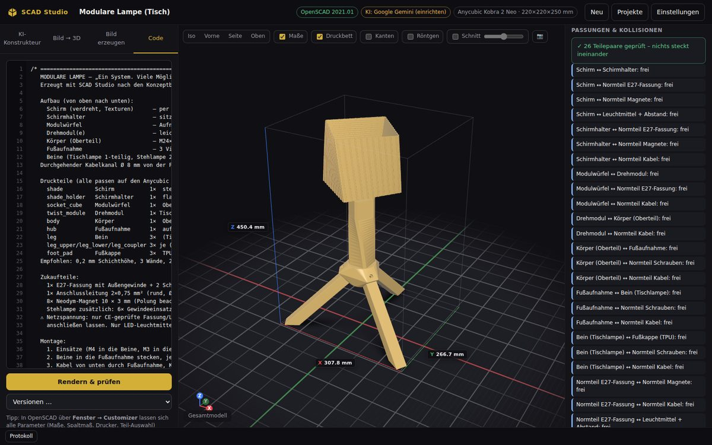
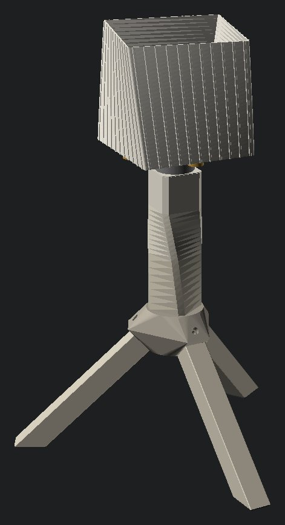
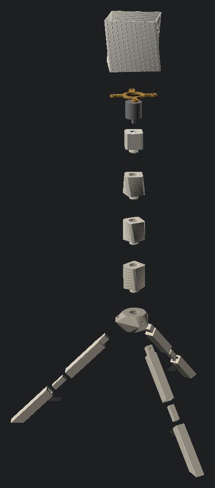
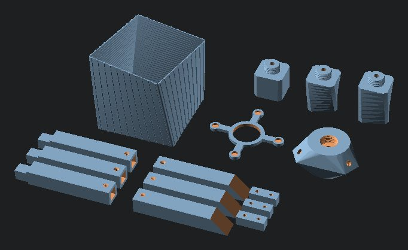

# SCAD Studio – dein KI-3D-Studio für OpenSCAD

SCAD Studio ist ein lokales Programm, das **OpenSCAD-Code automatisch erzeugt**, ihn mit deiner
installierten **OpenSCAD**-Version rendert und jedes Teil **auf Druckbarkeit prüft** – ähnlich wie
Meshy AI, aber mit sauberem, parametrischem CAD-Code, den du selbst weiter bearbeiten kannst.

- **KI-Konstrukteur:** Objekt beschreiben und/oder Bilder hochladen (z. B. aus Gemini) → die KI
  schreibt das OpenSCAD-Modell, das Studio rendert es, prüft es und lässt Fehler automatisch reparieren.
  Danach kannst du Änderungen einfach in Worten beschreiben („Beine 20 mm länger“).
- **Bild → 3D (ohne KI):** Relief, Lithophanie, flache Figur, Schild, Schlüsselanhänger, Stempel,
  Ausstechform und Schablone aus jedem Bild – ideal für Logos, Tattoo-Motive und Tiefenkarten.
- **Bild erzeugen:** Bilder direkt mit Google Gemini („Nano Banana“) erstellen – mit Vorlagen, die
  sich gut in 3D umwandeln lassen (Silhouette, Linienkunst, Tiefenkarte, Produktansicht …).
- **Prüfung & Druck:** Für jedes Druckteil: Maße, geschlossenes Netz (keine fehlenden Wände),
  Normalen, Mindest-Wandstärke, passt es aufs Druckbett (Standard: **Anycubic Kobra 2 Neo,
  220 × 220 × 250 mm**) – plus STL-Download pro Teil.
- **Passungsprüfung:** Das Studio setzt mehrteilige Modelle virtuell zusammen und prüft jedes
  Teilepaar auf Überschneidungen – so ist belegt, dass Gewinde, Stecker, Schrauben, Magnete und
  der Kabelweg wirklich passen, bevor du druckst.
- **Verbindungs-Bibliothek:** Getestete Gewinde, Einschmelzmuttern, Mutternfallen, Magnet-Taschen,
  Steck-, Schwalbenschwanz- und Schnappverbindungen mit einstellbarem Spaltmaß (Standard 0,2 mm).
- **Customizer-Variablen:** Jede erzeugte `.scad`-Datei hat oben Parameter (Maße, Spaltmaß, Drucker,
  Teil-Auswahl, Explosionsansicht), die du in OpenSCAD unter **Fenster → Customizer** ändern kannst.



| Tischlampe (Zusammenbau) | Stehlampe (Explosionsansicht) | Druckteile in Druckausrichtung |
|---|---|---|
|  |  |  |

*Beispiel „Modulare Lampe“ – nach zwei Konzeptbildern konstruiert. Alle Druckteile passen auf den
Kobra 2 Neo, die Passungsprüfung bestätigt 26 (Tisch) bzw. 29 (Steh) Teilepaare ohne Überschneidung.*

---

## 1. Installation (einmalig)

1. **OpenSCAD** – hast du schon. Empfehlung: zusätzlich eine aktuelle *Entwicklerversion*
   („Development Snapshot“) von [openscad.org/downloads](https://openscad.org/downloads.html)
   installieren. Die rendert dank *Manifold* oft 10–100× schneller als 2021.01. SCAD Studio
   erkennt das automatisch.
2. **Python 3.10 oder neuer** (empfohlen 3.12) von [python.org](https://www.python.org/downloads/).
   Unter Windows bei der Installation **„Add python.exe to PATH“** anhaken.
3. Diesen Ordner `scad-studio` irgendwo hin kopieren.

## 2. Starten

| System  | So geht's |
|---------|-----------|
| Windows | Doppelklick auf **`Start-Windows.bat`** |
| macOS   | Doppelklick auf **`Start-Mac.command`** (beim ersten Mal: Rechtsklick → Öffnen) |
| Linux   | `./start-linux.sh` |
| überall | `python start.py` |

Beim ersten Start werden die nötigen Pakete (Pillow, anthropic) automatisch installiert. Danach
öffnet sich der Browser mit **http://127.0.0.1:8765**. Das Programm läuft nur auf deinem Rechner;
nichts ist aus dem Internet erreichbar.

## 3. KI einrichten (Einstellungen → „KI für die Konstruktion“)

Du brauchst **eine** der folgenden Möglichkeiten:

| Anbieter | Kosten | Einrichtung |
|---|---|---|
| **Google Gemini** | kostenloses Kontingent | Schlüssel unter [aistudio.google.com/apikey](https://aistudio.google.com/apikey) erstellen und einfügen. Wird auch für „Bild erzeugen“ gebraucht. |
| **Claude Code (lokal)** | über dein Claude-Abo | [Claude Code](https://claude.com/claude-code) installieren, einmal `claude` im Terminal starten und anmelden. Kein Schlüssel nötig. „Denktiefe“ mittel ist der Standard; „niedrig“ ist schneller (gut für einfache Teile), „hoch“ gründlicher, aber deutlich langsamer. |
| **Anthropic Claude (API)** | nach Verbrauch | Schlüssel unter [platform.claude.com](https://platform.claude.com). Standardmodell `claude-opus-5`; Ausweichmodelle bei Ablehnungen sind aktiviert. |
| **Ollama (lokal)** | kostenlos, offline | [ollama.com](https://ollama.com) installieren, z. B. `ollama pull qwen3-vl:8b`, Basis-URL `http://localhost:11434/v1`. Wichtig: Ollama mit größerem Kontext starten (`OLLAMA_CONTEXT_LENGTH=16384`), sonst wird die Konstruktionsanleitung abgeschnitten. Lokale Modelle konstruieren deutlich schwächer als Gemini/Claude. |

**Dauer:** Eine KI-Konstruktion braucht je nach Modell und Umfang 1–15 Minuten (Claude Code denkt bei
komplexen, mehrteiligen Modellen gründlich nach). Im Protokoll siehst du jederzeit, was gerade passiert;
mit **Abbrechen** stoppst du den Vorgang.

Mit **„Verfügbare Modelle abrufen“** lädt das Studio die aktuellen Gemini-Modelle live.
Tipp: Für Gemini-Bilder ist `gemini-3.1-flash-lite-image` kostenlos nutzbar. `gemini-3.1-flash-image`
und `gemini-3-pro-image` liefern bessere Bilder, setzen aber ein Abrechnungskonto voraus.

**Auto-Reparaturen** (Standard 3): Meldet OpenSCAD Fehler oder findet die Prüfung Probleme (Teil zu groß
fürs Druckbett, zu dünne Wände, offenes Netz …), bekommt die KI den Bericht und korrigiert den Code.
**Visuelle Selbstprüfung** (Standard 1): Die KI sieht Renderings ihres Modells, vergleicht sie mit
deinem Auftrag und den Bildern und verbessert nach.

## 4. So arbeitest du damit

### KI-Konstrukteur
1. Beschreiben, was gebaut werden soll – je genauer (Maße, Verbindungen, Zweck), desto besser.
2. Optional Referenzbilder hineinziehen oder mit **Strg+V** einfügen (z. B. deine Gemini-Entwürfe).
3. **Modell erstellen** → im Protokoll unten siehst du jeden Schritt (KI, Rendern, Prüfen, Reparieren).
4. Rechts erscheint der **Prüfbericht** mit allen Druckteilen. Klick auf ein Teil zeigt es in 3D.
5. Änderungen einfach beschreiben → **Änderung umsetzen**. Jede Version bleibt erhalten
   (Code-Tab → „Versionen …“).

### Bild → 3D
Bild wählen, Umwandlung wählen, Regler einstellen (die Vorschau zeigt sofort, was erkannt wird),
**In 3D umwandeln**.

| Umwandlung | Wofür | Bild-Tipp |
|---|---|---|
| Relief | Wandbilder, Plaketten, echte 3D-Wirkung | Gemini-Vorlage **„Tiefenkarte“** (weiß = vorne) |
| Lithophanie | Foto-Leuchtbild | normales Foto, hochkant drucken, 100 % Infill |
| Figur / Schild | Logos, Tattoo-Motive, Deko | klare schwarze Formen auf Weiß |
| Anhänger | Schlüsselanhänger mit Öse | Vorlage „Silhouette“ |
| Stempel | spiegelverkehrter Stempel | Vorlage „Linienkunst“ |
| Ausstechform | Kekse, Fondant, Ton | geschlossene Silhouette |
| Schablone | Sprüh-/Malschablone | kräftige, verbundene Formen |

### Bild erzeugen (Gemini)
Vorlage wählen, Motiv beschreiben, **Bild erzeugen**. Mit **→ Bild → 3D** oder **→ KI-Konstrukteur**
geht es direkt weiter. Alle erzeugten Bilder landen zusätzlich im Ordner `~/SCAD-Studio/bilder`.

### Beispiele
Unter **Projekte → Beispiele** liegen fertige, geprüfte Modelle:
- **Modulare Lampe** (nach dem Mori-Konzept): verdrehter Schirm mit Texturen (Magnethalter, werkzeuglos
  tauschbar), Modulwürfel für E27-Fassung, Drehmodule und Körper mit M24×3-Gewinde (fluchten
  festgeschraubt), Fußaufnahme mit Vierkant-Steckverbindung + M4-Sicherungsschraube, Tisch- oder
  Stehlampe (`variant`), durchgehender Kabelkanal Ø 8 mm, alle Teile passen auf den Kobra 2 Neo.
- **Schraubdose (Passungstest):** kleines Gewinde-Testteil – erst drucken, dann weißt du, ob dein
  Drucker mit 0,2 mm Spaltmaß passende Gewinde druckt (sonst `tol` anpassen).

### Code
Voller Zugriff auf den OpenSCAD-Code: bearbeiten, **Strg+Enter** rendert und prüft neu.
**In OpenSCAD öffnen** startet dein OpenSCAD mit der Datei – dort über **Fenster → Customizer** alle
Parameter ändern. Die Bibliothek `studio.scad` liegt automatisch neben jedem Modell.

## 5. Was die Prüfung kontrolliert

- **Netz geschlossen:** keine offenen Kanten → keine fehlenden Wände, keine Löcher.
- **Normalen / Innen-außen:** alle Flächen richtig herum (im 3D-Viewer sind Rückseiten rötlich).
- **Maße** jedes Teils in mm, Volumen, Anzahl getrennter Körper.
- **Druckbett:** passt jedes Teil in 220 × 220 × 250 mm (Profil änderbar)? Wenn nur gedreht, gibt es einen Hinweis.
- **Wandstärke:** dünnste Stelle (Schätzung per Strahlmessung) gegen 2 Linienbreiten (0,88 mm) bzw.
  empfohlene 4 Linienbreiten. Einzelne Spitzen (z. B. Gewindezähne) zählen nur als Hinweis.
- **Auflage & Überhänge:** liegt das Teil flach auf, wie viel Fläche hängt mehr als 45° über?
- **Passungen (mehrteilige Modelle):** Knopf „Passungen prüfen“ im Prüfbericht. Alle Teile werden in
  Einbaulage gebracht, jedes Paar mit sich berührenden Hüllquadern wird geschnitten – jede
  Überschneidung wird mit Volumen gemeldet. Zukaufteile (Schrauben, Magnete, Fassung, Kabel,
  Leuchtmittel mit Mindestabstand) werden als „Normteile“ (`hw_…`) mitgeprüft, aber nie gedruckt.
  Mit dem schnellen Manifold-Backend läuft die Prüfung nach jedem KI-Schritt automatisch
  (Einstellungen → „Passungsprüfung“).

Im 3D-Viewer: **Maße** blendet die Abmessungen ein, **Druckbett** zeigt das Bett des Druckers
(rot = passt nicht), **Schnitt** schneidet das Modell waagerecht auf, um Wände innen zu prüfen.

## 6. Druck- und Konstruktionsregeln (fließen automatisch in die KI ein)

- Wände ≥ 0,8 mm, tragend ≥ 1,2–1,6 mm, um Gewinde/Einsätze ≥ 2,5 mm.
- Überhänge ≤ 45°, Fasen statt Rundungen nach unten, waagerechte Löcher als Tropfenform.
- Spaltmaß pro Seite: 0,2 mm (Steck-/Gleitpassung), Presspassung 0–0,1 mm, locker 0,3–0,5 mm.
- Gedruckte Gewinde erst ab M8 (besser M16–M40, Steigung 2,5–4 mm, senkrecht drucken).
  M3–M6: **Einschmelzmuttern** (M3: Loch 4,0 mm, M4: 5,6 mm, M5: 6,4 mm) oder Mutternfallen.
- Große Objekte werden in Teile zerlegt, die aufs Druckbett passen – mit sinnvollen Verbindungen.
- **Lampen:** Kabelkanal ≥ 8 mm, E27/E14-Fassung über M10×1-Gewinderohr (Loch 10,4 mm +
  Mutterntasche), nur LED ≤ 10 W, ≥ 30 mm Abstand zum Schirm (PLA wird ab ~55 °C weich).
  ⚠️ Netzspannung: nur CE-geprüfte Fassungen/Anschlussleitungen verwenden, im Zweifel Elektriker fragen.

## 7. Kommandozeile (auch für Claude Code)

```bash
python -m scadstudio info                               # Einrichtung prüfen
python -m scadstudio ai "Wandhalter für Kopfhörer" -i skizze.png
python -m scadstudio render meine_lampe.scad            # rendern, Teile exportieren, prüfen
python -m scadstudio check teil.stl                     # STL prüfen
python -m scadstudio image logo.png --mode keychain --size 50
python -m scadstudio printers                           # Druckerprofile
```

Alle Befehle legen ein Projekt an, das auch in der Oberfläche erscheint. Mit `--json` gibt es das
Ergebnis maschinenlesbar – so kann z. B. Claude Code auf deinem Rechner Modelle erzeugen, prüfen und
verbessern.

## 8. Wo liegen meine Dateien?

Alles liegt im Benutzerordner **`~/SCAD-Studio`** (Windows: `C:\Users\<Name>\SCAD-Studio`):

```
SCAD-Studio/
  settings.json        Einstellungen inkl. API-Schlüssel (bleibt auf deinem Rechner)
  bilder/              mit Gemini erzeugte Bilder
  projekte/<projekt>/
    model.scad         OpenSCAD-Code (in OpenSCAD öffnen)
    studio.scad        Verbindungs-Bibliothek
    model.stl          Gesamtmodell
    parts/*.stl        einzelne Druckteile
    inputs/            deine Bilder
    versions/          alle früheren Code-Stände
```

**Datenschutz:** Bilder und Beschreibungen gehen nur an den KI-Anbieter, den du auswählst. Mit
Ollama bleibt alles auf deinem Rechner.

## 9. Grenzen & Tipps

- OpenSCAD baut Objekte aus Grundkörpern (CSG). Technische Teile, Gehäuse, Halter, Lampen,
  Vasen, Möbel-Modelle gelingen sehr gut. **Organische Figuren** (Tiere, Gesichter) werden nur
  stilisiert. Dafür besser: Gemini-Tiefenkarte → **Relief**, oder ein Mesh-KI-Tool (Meshy, Tripo …)
  und das STL anschließend in OpenSCAD per `import()` weiterverarbeiten.
- OpenSCAD 2021.01 rendert komplexe Modelle mit Gewinden langsam (Minuten). Eine
  Entwicklerversion mit Manifold beschleunigt das enorm.
- Ergebnis nicht perfekt? Konkrete Änderungen beschreiben („Schirm 10 mm höher, Gewinde M30“),
  ein weiteres Referenzbild beilegen oder direkt die Customizer-Parameter anpassen.

## 10. Fehlerbehebung

| Problem | Lösung |
|---|---|
| „OpenSCAD nicht gefunden“ | Einstellungen → OpenSCAD → Pfad zur `openscad.exe` (Windows) bzw. `/Applications/OpenSCAD.app` (Mac) angeben. |
| Gemini: 429 / Kontingent | Kurz warten, kleineres Modell wählen (`gemini-3.5-flash-lite`) oder Abrechnung aktivieren. |
| Gemini: Modell nicht gefunden | „Verfügbare Modelle abrufen“ und ein Modell aus der Liste wählen. |
| Entwicklerversion startet unter Windows nicht als Programm | Zum Rendern trotzdem nutzen (Einstellungen → „Pfad zum Rendern“), und unter „Pfad zum Öffnen“ die stabile `C:\Program Files\OpenSCAD\openscad.exe` eintragen. |
| Rendern dauert sehr lange | Entwicklerversion von OpenSCAD installieren (Manifold), Zeitlimit in den Einstellungen erhöhen. Teile und Passungen werden automatisch parallel gerendert (Kerne − 1). |
| Port belegt | `python start.py --port 9000` |

Tests (für Entwickler): `python -m unittest discover -s tests`
